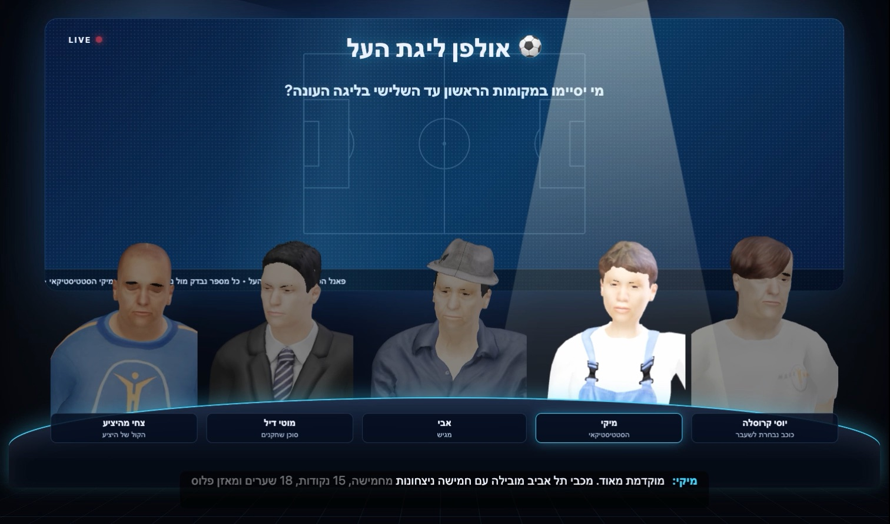
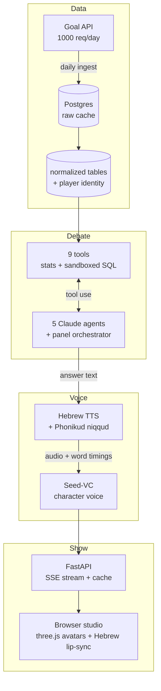

# AI Football Studio ⚽

**A TV-style panel of AI pundits that debates the Israeli Premier League (Ligat Ha'Al) in Hebrew,
with talking 3D avatars. Every number they say comes from real match data.**

Ask the panel a question ("Will Maccabi Tel Aviv win the title?", "Is Eliel Peretz leading
Hapoel Be'er Sheva?"). Five AI agents, each with a different worldview, look up the data, argue with
each other, fact-check each other, and the host sums it all up. You watch it in a virtual studio,
spoken aloud in each character's own voice.



## The panel

| | Character | Worldview |
|---|---|---|
| 📺 | **Avi**, the host | Runs the show, keeps the debate moving, sums up using only fact-checked numbers |
| 📊 | **Miki**, the statistician | Believes nothing without data. Opens with the numbers and fact-checks everyone, including himself |
| 🏆 | **Yossi "Karusela" Israeli**, national-team legend | "Numbers don't see heart." Judges players by hunger and character |
| 💼 | **Moti Deal**, player agent | Every player is a portfolio, every goal a contract clause |
| 📣 | **Tzachi from the stands** | Not a fan of one club but of football itself. Pure emotion |

A debate follows a fixed script:
1. Avi opens.
2. Miki answers with data.
3. Each guest reacts from their angle.
4. Miki fact-checks every factual claim with the tools, saying what's true, false or uncheckable.
5. Each guest gets a last word, where no new numbers are allowed.
6. Avi sums up.

## How it works



**Agents (Claude, Anthropic API).**
- Each pundit is a manual tool-use loop with its own persona.
- A panel orchestrator runs the script and passes the transcript between turns.
- Grounding rules:
  - no number without a tool call;
  - seasons always named explicitly, since "last season" caused false contradictions;
  - arithmetic done in SQL, not in the model's head.
- Uses adaptive thinking, prompt caching and server-side model fallbacks. A full debate costs about $0.60.

**Data pipeline.**
- The free data provider is messy, so the pipeline trusts raw events over the provider's aggregates.
- Every API response is cached raw in Postgres, so re-normalizing costs no quota.
- Ingestion is idempotent, commits per match, and holds an advisory lock so two runs never burn quota twice.
- Players who appear under several IDs are merged with union-find. The rule: compatible names at the same club, never in the same lineup.

**Tools.**
- 9 tools: league table, top scorers, player stats, form, head-to-head, match stats, match report, data coverage, and a free-form `run_sql`.
- The SQL tool has four independent safety layers:
  - a read-only Postgres role;
  - read-only transactions with a statement timeout;
  - a single SELECT per call;
  - row and character caps on results.

**Hebrew speech.**
- Numbers are spelled out in words.
- Every answer is vocalized from context with [Phonikud](https://github.com/thewh1teagle/phonikud), so ambiguous words are read right.
- The niqqud is cleaned before speaking. For example, a dagesh in ג/ד/ת made the voice say "dvor" instead of "dor".

**A voice per character.**
- Hebrew TTS has a single male voice. It speaks first (good Hebrew, plus word timings).
- [Seed-VC](https://github.com/Plachtaa/seed-vc) then re-voices it from a ~10-second recording of each character, running locally on Apple Silicon.
- Conversion keeps timing, so lip-sync stays aligned.
- Why Seed-VC: Chatterbox's Hebrew TTS mangled words, and its converter changed Hebrew sounds. Seed-VC understands speech through Whisper, which knows Hebrew.

**Avatars.**
- Characters are built in Blender with MakeHuman (MPFB) and exported by a headless script, which fixes materials and rig and adds visemes.
- Textures are compressed to WebP (21MB → 9MB, 3.5MB gzipped).
- They're rendered with three.js and [TalkingHead](https://github.com/met4citizen/TalkingHead).
- A custom Hebrew lip-sync module maps Hebrew letters to mouth shapes.
- The speaker gets a spotlight and face lighting. Listeners dim and turn to look at them.

**Server.**
- FastAPI streams the debate as Server-Sent Events: turn, tool call ("Miki is checking the league table..."), then speech.
- Converted speech is cached.
- Every debate is saved and can be replayed for free.
- `record_video.sh` records a replay to MP4 with Chrome's own tab recorder.

**Tests.** 70 tests (pytest) cover:
- stats invariants against the real database;
- SQL sandbox escapes;
- the panel script;
- Hebrew number and niqqud handling;
- the speech pipeline;
- the SSE server.

## Project structure
```
backend/
  app/sources/   API client with a raw-response cache
  app/ingest/    normalization + player identity resolution
  app/tools/     the tools the pundits call: stats queries and sandboxed read-only SQL
  app/agents/    pundit agent loop, personas, panel orchestrator
  app/speech/    Hebrew numbers, niqqud (Phonikud), TTS + voice conversion
  app/server.py  FastAPI: SSE debate stream, replays, static studio
  db/            schema.sql, readonly_role.sql
  scripts/       ingest.py, ask.py, panel.py, record_video.sh
  tests/
frontend/
  studio/        the TV studio page + Hebrew lip-sync module
  avatars/       compressed character models (.glb)
voice/           Seed-VC voice-conversion service (runs in its own environment)
blender/         headless avatar export + texture compression
docs/            Hebrew code walkthrough
```

## Setup
```bash
brew install postgresql@18 && brew services start postgresql@18
createdb football

cd backend
python3 -m venv .venv && source .venv/bin/activate
pip install -r requirements-dev.txt
cp .env.example .env                        # fill in API keys (Anthropic, Goal API)
# Automatic niqqud for the TTS voice (Phonikud, ~300MB, git-ignored)
curl -L -o models/phonikud-1.0.int8.onnx --create-dirs \
  https://huggingface.co/Phonikud/phonikud-onnx/resolve/main/phonikud-1.0.int8.onnx

python scripts/ingest.py                    # run daily: syncs fixtures + as many match details as the quota allows
psql -d football -f db/readonly_role.sql    # read-only role for the run_sql tool
pytest tests
```

### Run the studio
```bash
cd backend && .venv/bin/uvicorn app.server:app --port 8010
# open http://localhost:8010 : "▶ דיון לדוגמה" replays a recorded debate for free,
# or type a question to run a live panel (~$0.60)
```

### Character voices (optional)
Without this service everyone speaks in the plain TTS voice.
```bash
git clone https://github.com/Plachtaa/seed-vc tools/seed-vc
/opt/homebrew/bin/python3.11 -m venv tools/seed-vc/.venv
tools/seed-vc/.venv/bin/pip install torch torchaudio -r voice/requirements.txt
# put avi.wav, miki.wav, yossi.wav, moti.wav, tzachi.wav (~10s each) in tools/voices/
tools/seed-vc/.venv/bin/python voice/converter_server.py     # http://localhost:8020
```

### Record a debate as video
```bash
sh backend/scripts/record_video.sh 20260927-150010 top-3     # -> videos/top-3.mp4
```

### Rebuild a character (Blender → browser)
```bash
blender -b tools/blender/yossi.blend --python blender/export_avatar.py -- frontend/prototype/avatars/yossi.glb
sh blender/compress_avatars.sh yossi      # 1024px WebP textures: ~21MB -> ~9MB (~3.5MB gzipped)
```

## Data quality notes
The free data source has known problems. The pipeline works around them instead of trusting the provider's aggregates:
- **The top-scorers and standings endpoints are wrong or stale.** Tables and scorer lists are computed from raw results and goal events.
- **The same player can show up under several IDs.** For example, the lineup uses one key and the goal event another. `app/ingest/players.py` merges keys with compatible names at the same club that never appear in the same lineup.
- **Key `0` means "unknown player".** It's dropped rather than merged.
- **Some matches have no goal events at all.** `fixtures.goals_complete` flags them, and the tools warn that totals may be slightly low.
- **Some match stats contradict each other** (`On Target` vs `Shots On Goal`), and the tools say so.

## Credits
- [Phonikud](https://github.com/thewh1teagle/phonikud) (CC BY 4.0)
- [Seed-VC](https://github.com/Plachtaa/seed-vc) (GPL-3.0, run as a separate service)
- [TalkingHead](https://github.com/met4citizen/TalkingHead)
- [MPFB / MakeHuman](https://static.makehumancommunity.org/mpfb.html)
- [edge-tts](https://github.com/rany2/edge-tts)

All characters are fictional. Voices are recorded with the speakers' consent.
